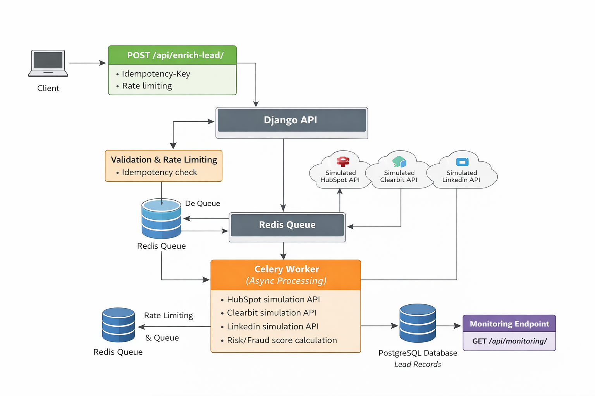
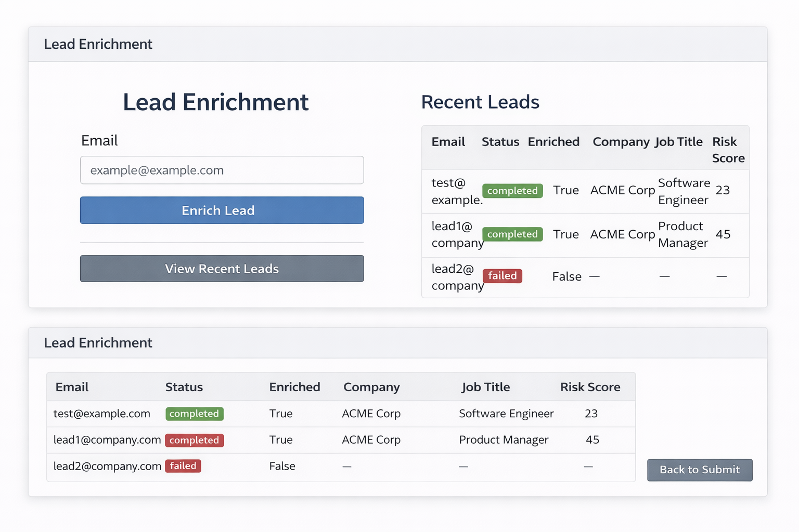

# Lead Enrichment API

## Features

- Async lead enrichment using Celery
- Multiple simulated providers: HubSpot, Clearbit, LinkedIn
- Risk/Fraud scoring simulation
- Idempotency support with Idempotency-Key header
- Rate limiting using Redis
- Monitoring endpoint for system stats
- Dockerized & production-ready

## Run locally

1. `docker-compose up --build`
2. POST `/api/enrich-lead/` with JSON `{"email":"test@example.com"}` and optional `Idempotency-Key` header
3. GET `/api/monitoring/` for stats

## Documentation

### Environment Variables
- `SECRET_KEY`: Django secret key
- `DEBUG`: Set to `True` for development, `False` for production
- `DJANGO_ALLOWED_HOSTS`: Comma-separated list of allowed hosts
- `DATABASE_URL`: Database connection string (e.g., `sqlite:///db.sqlite3` or PostgreSQL URL)
- `REDIS_URL`: Redis connection string for Celery and rate limiting

### Main Endpoints
- `/` : Home UI for lead enrichment
- `/results/` : View recent leads
- `/monitoring/` : System monitoring UI
- `/api/enrich-lead/` (POST): Enrich a lead (JSON: `{ "email": "test@example.com" }`)
- `/api/monitoring/` (GET): System stats and Celery health
- `/api/monitoring/` (Response): `{ "total_leads": int, "by_status": [...], "system": "healthy", "celery": "ok|fail" }`

### Celery
- Celery is used for async lead enrichment. Health is checked via the monitoring endpoint.

### Security
- Uses secure cookie settings, XSS protection, and HSTS in production.

### Development
- Use `.env` for environment variables.
- Run `python manage.py makemigrations` and `python manage.py migrate` to set up the database.
- Start the server with `python manage.py runserver`.

### Logging
- Logs are output to the console with timestamps and log levels.

### Project Structure
- `apps/enrichment/`: Main app for enrichment logic, tasks, and UI
- `apps/common/`: Shared utilities
- `config/`: Django settings, URLs, Celery config

For more details, see code docstrings and comments.
